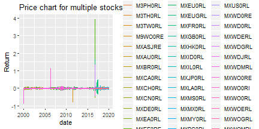
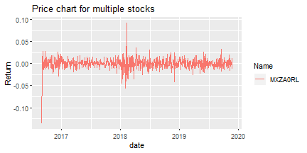
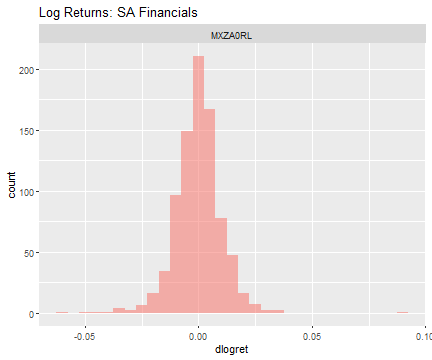
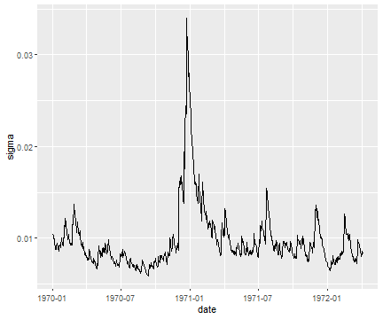
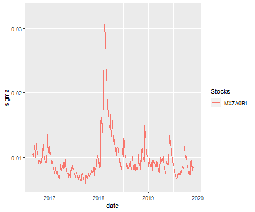

<!-- First: Set your default preferences for chunk options: -->

<!-- If you want a chunk's code to be printed, set echo = TRUE. message = FALSE stops R printing ugly package loading details in your final paper too. I also suggest setting warning = FALSE and checking for warnings in R, else you might find ugly warnings in your paper. -->


<!-- ############################## -->
<!-- # Start Writing here: -->
<!-- ############################## -->

# Introduction \label{Introduction}

Recently, the linkage between real estate investment and trusts (REITs) and finance has been a crucial field of interest, due to the increasing importance of property as a significant asset class in investment. This has been further enhanced by the economic condition of the United States relating to the systematic defaulting of subprime borrowers. Consequently, this has influenced how investors diversify their portfolios. Portfolio diversification means holding equities across various sectors [@stephensinter2017]. However; this paper will specifically analyses REITs returns between different countries. Real estate investment and trusts (REITs) returns have been significantly examined in the literature, however; reviews that have examined the REITs return comovements between South Africa and different countries are have not been explored in greater depth. Relatively, little research has been performed in the South African REITs compared to other REITs markets [@nurick2018investigation; @anderson2016place].

The purpose of this paper is to analyze the co-movements and the portfolio diversification the REITs of South Africa and its trading partners. Furthermore, the Multivariate (MV) GARCH modelling is used to examine the conditional correlations between REITs in different countries. The rationale for multivariate (MV) GARCH modelling technique is for investors to include time-varying correlations in their portfolio selection, hence this paper explores their properties. The results offer valuable insights into which the South African REITs appear to provide a better diversification relative to the rest of the stocks.  Secondly, 

The paper is structured as follows: Section \ref{Literature Review} presents the relevant literature. Section \ref{Data} discusses the data used in the paper and section \ref{Methodology} provides a comprehensive methodology employed in this paper. Section \ref{Results} presents the results of the estimated models. Lastly, we will conclude in section \ref{Conclusion}.

References are to be made as follows: @fama1997[p. 33] and @grinold2000 Such authors could also be referenced in brackets [@grinold2000] and together [@fama1997 \& @grinold2000]. Source the reference code from scholar.google.com by clicking on ``cite'' below article name. Then select BibTeX at the bottom of the Cite window, and proceed to copy and paste this code into your ref.bib file, located in the directory's Tex folder. Open this file in Rstudio for ease of management, else open it in your preferred Tex environment. Add and manage your article details here for simplicity - once saved, it will self-adjust in your paper.

# Literature Review \label{Literature Review}

The literature significant to this study focuses on South African and international Reits in the light of portfolio management. The driving factors cited in the literature for international investment are diversification and risk-adjusted-performance [@worzala1994overseas; @austin1995risk; @worzala2003investing]. This trade-off between risk and return is based on a conventional portfolio theory that prudent investors choose portfolios with the lowest risk for a specific level of return. In other words, diversification of portfolios creates incentives for risk reduction, such as diversification of real estate portfolios to include offshore investments without reducing returns [@austin1995risk]. It is also worth noting that, in portfolio theory, low correlations between dissimilar stocks will increase diversification potential and decrease portfolio risk [@stephensinter2017]. Put differently, the various types of investments should not follow the same pattern in the market. Therefore, the rewards of portfolio diversification weigh heavily on the correlation framework of the stock markets examined.

@bruin2009real stated that in real estate investment, portfolio diversification benefits can be accomplished by diversifying across property types and geographical regions. It has been found that various forms of international real estate have weak correlations with other types of investment, hence contribute to a well-diversified portfolio. Moreover, the literature has well-documented evidence that there is a weak correlation between emerging markets and developed markets resulting in diversification benefits [@basu2005benefits; @barry1998performance; @magas2007changing]. However; the perception that there is a weak correlation between emerging markets and developed markets is deteriorating. For instance @wong2004relationship examined the co-movement between stock markets in Asian emerging markets and developed countries using cointegration analysis. They found that there is an increasing correlation between most emerging and developed markets. @chancharat2007empirical employed cointegration and causality tests between major international stock markets and Thailand and found a high correlation between Thailand and other international markets. 

The results of various studies on diversification of real estate are based on modern portfolio theory (MPT) [@paul1991risk; @seiler1999diversification; @wilson2003international]. However; @theron2018maximum stated that the Modern portfolio approach is rather flawed because it assumes all parameters are known accurately. These parameters (covariances, variances and expected returns) are estimated not necessarily known with certainty. As a result, this uncertainty in parameters leads to estimation risk, which in turn also leads to suboptimal investor financial choices. Modern portfolio theorem was also criticized for the inefficient performance of many institutional portfolios during the financial crisis of 2008/2009 because most portfolios were focused on Markowitz’s optimization of portfolios, a mechanism that was widely assumed would provide the necessary diversification to prevent seriously negative portfolios [@choueifaty2013properties]. Modern portfolio models also introduced assets with weak equity correlations, but most asset class correlations increased during the crisis and expected diversification benefits were negligible. Therefore, there is a need for alternative investment ideas. 

In addition to these studies, some focus primarily on developed markets in the US, Canada, Europe and Japan, for instance [@bond2006performance; @basse2009reits; @moss2014asia]. @bond2006performance found that real estate has contributed substantially to the overall portfolio outcomes in terms of higher returns and decreases risk. Secondly, the authors are consistent with other researchers that real estate investment performs well during periods of market change. @basse2009reits found that investing in US REITs was riskier compared to investment in utility stocks. Further analysis linked this result to the economic state and financial crisis in the US. @moss2014asia examined the correlation between developed Asian REITs and other developed countries and found that there are interdependent linkages among the REITs market of developed countries.

Certain literature studies analyze stock price linkages between emerging stock markets only, without capturing major stock influences in developed countries [@sharma2002long; @san2012malaysian; @yang2003stock]. Their findings suggest that Reits provided a better diversification post-financial crisis. @sharma2002long and @yang2003stock found low evidence of the correlation among Asian stock markets. Also, some studies analyses the interrelationships between developed and emerging markets. For instance, @pham2012dynamics examined the dynamics of returns and volatility in emerging and developed markets and found that correlations among emerging Reits are lower than those among developed countries.

In investment of real estate, the advantages of portfolio diversification can be accomplished by introducing international real estate into the portfolio. @worzala2003investing found that with the introduction of international real estate to the portfolio, portfolio performance improves significantly. @worzala2003investing discovered that investment in securities linked to international real estate offers additional diversification advantages. Similarly, @niskanen2010reits claimed that international diversification of REITs investment is suggested to reduce exposure due to economic uncertainties within countries. Nonetheless, the question asked in this research is “are there any types of interdependence or dynamic correlation between South Africa and international markets?


> I suggest renaming the top line after \@article, as done in the template ref.bib file, to something more intuitive for you to remember. Do not change the rest of the code. Also, be mindful of the fact that bib references from google scholar may at times be incorrect. Reference Latex forums for correct bibtex notation.

To reference a section, you have to set a label using ``\\label'' in R, and then reference it in-text as e.g.: section \ref{Data}.


Writing in Rmarkdown is surprizingly easy - see [this website](https://www.rstudio.com/wp-content/uploads/2015/03/rmarkdown-reference.pdf) cheatsheet for a summary on writing Rmd writing tips.

# Data \label{Data}

The aim of this study is to investigate the correlation of the Reits market of South Africa and its trading partner countries to access the diversification benefits. The return series are time-varying, intradays as well as over days. In the light of this, it is undesirable to apply models assuming time-invariant conditional variances. 

We picked a sample of 11 developed and emerging markets comprising of South Africa, and its trading patners. All
data is obtained from Morgan Stanely Capital International (MSCI) and encompasses of high frequency data of different from 2016 to 2020. 

The stock value indexes are expressed in US dollars to avoid exchange rates fluctuations. For further analysis, the continuously compounded weekely returns are calculated by taking the log difference of each listed company as follows


Discssion of data should be thorough with a table of statistics and ideally a figure. 

In your template folder, you will find a Data and a Code folder. In order to keep your data files neat, store all of them in your Data folder. Also, I strongly suggest keeping this Rmd file for writing and executing commands, not writing out long pieces of data-wrangling. In the example below, I simply create a ggplot template for scatter plot consistency. I suggest keeping all your data in a data folder.

<!-- The following is a code chunk. It must have its own unique name (after the r), or no name. After the comma follows commands for R which are self-explanatory. By default, the code and messages will not be printed in your pdf, just the output: -->



To reference the plot above, add a ``\\label'' after the caption in the chunk heading, as done above. Then reference the plot as such: As can be seen, figure \ref{Figure1} is excellent. The nice thing now is that it correctly numbers all your figures (and sections or tables) and will update if it moves. The links are also dynamic.

I very strongly suggest using ggplot2 (ideally in combination with dplyr) using the ggtheme package to change the themes of your figures.

Also note the information that I have placed above the chunks in the code chunks for the figures. You can edit any of these easily - visit the Rmarkdown webpage for more information.

Here follows another figure from built-in ggplot2 data:




#  Methodology

## Subsection
Ideally do not overuse subsections. It equates to bad writing.^[This is an example of a footnote by the way. Something that should also not be overused.]

## Math section

Equations should be written as such:

\begin{align} 
\beta = \sum_{i = 1}^{\infty}\frac{\alpha^2}{\sigma_{t-1}^2} \label{eq1} \\ 
\int_{x = 1}^{\infty}x_{i} = 1 \notag
\end{align}

If you would like to see the equations as you type in Rmarkdown, use $ symbols instead (see this for yourself by adjusted the equation):

$$
\beta = \sum_{i = 1}^{\infty}\frac{\alpha^2}{\sigma_{t-1}^2} \\ 
\int_{x = 1}^{\infty}x_{i} = 1
$$

Note again the reference to equation \ref{eq1}. Writing nice math requires practice. Note I used a forward slashes to make a space in the equations. I can also align equations using  __\&__, and set to numbering only the first line. Now I will have to type ``begin equation'' which is a native \LaTeX command. Here follows a more complicated equation:


\begin{align}  
	y_t &= c + B(L) y_{t-1} + e_t   \label{eq2}    \\ \notag 
	e_t &= H_t^{1/2}  z_t ; \quad z_t \sim  N(0,I_N) \quad \& \quad H_t = D_tR_tD_t \\ \notag
		D_t^2 &= {\sigma_{1,t}, \dots, \sigma_{N,t}}   \\ \notag
		\sigma_{i,t}^2 &= \gamma_i+\kappa_{i,t}  v_{i, t-1}^2 +\eta_i  \sigma_{i, t-1}^2, \quad \forall i \\ \notag
		R_{t, i, j} &= {diag(Q_{t, i, j}}^{-1}) . Q_{t, i, j} . diag(Q_{t, i, j}^{-1})  \\ \notag
		Q_{t, i, j} &= (1-\alpha-\beta)  \bar{Q} + \alpha  z_t  z_t'  + \beta  Q_{t, i, j} \notag
\end{align}

Note that in \ref{eq2} I have aligned the equations by the equal signs. I also want only one tag, and I create spaces using ``quads''. 

See if you can figure out how to do complex math using the two examples provided in \ref{eq1} and \ref{eq2}.

<!-- $$ -->
<!-- This is a commented out section in the writing part. -->
<!-- Comments are created by highlighting text, amnd pressing CTL+C -->
<!-- \\begin{align} -->
<!-- \\beta = \\alpha^2 -->
<!-- \end{align} -->
<!-- $$ -->

# Results


Tables can be included as follows. Use the _xtable_ (or kable) package for tables. Table placement = H implies Latex tries to place the table Here, and not on a new page (there are, however, very many ways to skin this cat. Luckily there are many forums online!).


\begin{table}[H]
\centering
\begin{tabular}{rllrrrrrrrrrrrrr}
  \hline
 & item & group1 & vars & n & mean & sd & median & trimmed & mad & min & max & range & skew & kurtosis & se \\ 
  \hline
X11 & 1 & MXZA0RL & 1.00 & 844.00 & 973.83 & 90.42 & 945.84 & 964.20 & 87.24 & 842.82 & 1227.20 & 384.38 & 0.76 & -0.41 & 3.11 \\ 
   \hline
\end{tabular}
\caption{Descriptive Statistics Table \label{tab1}} 
\end{table}

To reference calculations __in text__, _do this:_ From table \ref{tab1} we see the average value of mpg is 20.98.

Including tables that span across pages, use the following (note that I add below the table: ``continue on the next page''). This is a neat way of splitting your table across a page.

Use the following default settings to build your own possibly long tables. Note that the following will fit on one page if it can, but cleanly spreads over multiple pages:

                 Returns  Returns_Sqd  Returns_Abs
2016-09-30 -9.641560e-03 9.295968e-05 9.641560e-03
2016-10-03  2.960627e-03 8.765314e-06 2.960627e-03
2016-10-04  9.304682e-03 8.657710e-05 9.304682e-03
2016-10-05 -8.228189e-03 6.770309e-05 8.228189e-03
2016-10-06 -7.679819e-04 5.897962e-07 7.679819e-04
2016-10-07  1.314181e-03 1.727071e-06 1.314181e-03
2016-10-10 -3.431758e-03 1.177697e-05 3.431758e-03
2016-10-11 -7.765934e-03 6.030973e-05 7.765934e-03
2016-10-12 -1.186640e-02 1.408113e-04 1.186640e-02
2016-10-13 -1.222203e-02 1.493780e-04 1.222203e-02
2016-10-14  9.637188e-03 9.287539e-05 9.637188e-03
2016-10-17  4.943292e-03 2.443613e-05 4.943292e-03
2016-10-18  8.514573e-03 7.249795e-05 8.514573e-03
2016-10-19  1.410488e-03 1.989476e-06 1.410488e-03
2016-10-20  1.857991e-03 3.452130e-06 1.857991e-03
2016-10-21  1.478567e-02 2.186162e-04 1.478567e-02
2016-10-24  9.111508e-03 8.301958e-05 9.111508e-03
2016-10-25 -7.915788e-03 6.265970e-05 7.915788e-03
2016-10-26 -9.411999e-03 8.858572e-05 9.411999e-03
2016-10-27 -3.037353e-03 9.225510e-06 3.037353e-03
2016-10-28 -1.064531e-02 1.133227e-04 1.064531e-02
2016-10-31  1.741460e-02 3.032685e-04 1.741460e-02
2016-11-01 -7.297562e-03 5.325441e-05 7.297562e-03
2016-11-02 -1.421445e-03 2.020506e-06 1.421445e-03
2016-11-03 -5.858398e-03 3.432082e-05 5.858398e-03
2016-11-04 -1.203292e-02 1.447912e-04 1.203292e-02
2016-11-07  9.469728e-04 8.967575e-07 9.469728e-04
2016-11-08  1.742487e-02 3.036259e-04 1.742487e-02
2016-11-09 -8.987311e-03 8.077177e-05 8.987311e-03
2016-11-10 -2.120622e-02 4.497037e-04 2.120622e-02
2016-11-11 -1.025049e-02 1.050726e-04 1.025049e-02
2016-11-14 -1.801558e-02 3.245613e-04 1.801558e-02
2016-11-15  1.553722e-02 2.414053e-04 1.553722e-02
2016-11-16  1.513661e-03 2.291169e-06 1.513661e-03
2016-11-17  6.475552e-03 4.193277e-05 6.475552e-03
2016-11-18  1.457196e-03 2.123420e-06 1.457196e-03
2016-11-21 -4.757983e-03 2.263840e-05 4.757983e-03
2016-11-22  1.822277e-03 3.320695e-06 1.822277e-03
2016-11-23 -5.451687e-03 2.972089e-05 5.451687e-03
2016-11-24 -1.306714e-02 1.707502e-04 1.306714e-02
2016-11-25  1.356517e-02 1.840139e-04 1.356517e-02
2016-11-28  6.301926e-03 3.971428e-05 6.301926e-03
2016-11-29 -2.823895e-03 7.974381e-06 2.823895e-03
2016-11-30  3.363802e-03 1.131517e-05 3.363802e-03
2016-12-01 -9.461091e-03 8.951225e-05 9.461091e-03
2016-12-02 -8.356111e-03 6.982459e-05 8.356111e-03
2016-12-05  6.294890e-03 3.962564e-05 6.294890e-03
2016-12-06 -8.643918e-03 7.471731e-05 8.643918e-03
2016-12-07  1.231342e-02 1.516203e-04 1.231342e-02
2016-12-08 -5.552322e-03 3.082828e-05 5.552322e-03
2016-12-09  2.655852e-02 7.053550e-04 2.655852e-02
2016-12-12 -2.497731e-03 6.238660e-06 2.497731e-03
2016-12-13  1.988518e-02 3.954204e-04 1.988518e-02
2016-12-14 -5.956118e-03 3.547535e-05 5.956118e-03
2016-12-15 -2.901639e-02 8.419508e-04 2.901639e-02
2016-12-16  0.000000e+00 0.000000e+00 0.000000e+00
2016-12-19  9.110348e-03 8.299844e-05 9.110348e-03
2016-12-20  1.639166e-02 2.686864e-04 1.639166e-02
2016-12-21 -3.435254e-03 1.180097e-05 3.435254e-03
2016-12-22 -5.564109e-03 3.095931e-05 5.564109e-03
2016-12-23 -2.245268e-03 5.041229e-06 2.245268e-03
2016-12-26  0.000000e+00 0.000000e+00 0.000000e+00
2016-12-27  0.000000e+00 0.000000e+00 0.000000e+00
2016-12-28  2.117513e-02 4.483863e-04 2.117513e-02
2016-12-29  1.304286e-02 1.701161e-04 1.304286e-02
2016-12-30  5.246647e-03 2.752731e-05 5.246647e-03
2017-01-02  0.000000e+00 0.000000e+00 0.000000e+00
2017-01-03  9.087270e-03 8.257847e-05 9.087270e-03
2017-01-04  1.669003e-03 2.785572e-06 1.669003e-03
2017-01-05 -1.198224e-02 1.435742e-04 1.198224e-02
2017-01-06  1.442260e-02 2.080115e-04 1.442260e-02
2017-01-09  4.365991e-03 1.906188e-05 4.365991e-03
2017-01-10 -1.423506e-03 2.026369e-06 1.423506e-03
2017-01-11  8.443863e-04 7.129882e-07 8.443863e-04
2017-01-12  2.802898e-03 7.856238e-06 2.802898e-03
2017-01-13  1.042381e-02 1.086558e-04 1.042381e-02
2017-01-16 -6.073710e-04 3.688996e-07 6.073710e-04
2017-01-17 -1.366050e-02 1.866092e-04 1.366050e-02
2017-01-18  4.937057e-03 2.437453e-05 4.937057e-03
2017-01-19  1.359849e-03 1.849189e-06 1.359849e-03
2017-01-20 -9.698812e-03 9.406695e-05 9.698812e-03
2017-01-23  3.248882e-03 1.055523e-05 3.248882e-03
2017-01-24  2.712757e-03 7.359052e-06 2.712757e-03
2017-01-25  3.854630e-03 1.485817e-05 3.854630e-03
2017-01-26  5.970258e-03 3.564398e-05 5.970258e-03
2017-01-27 -1.048627e-02 1.099618e-04 1.048627e-02
2017-01-30 -3.417591e-03 1.167993e-05 3.417591e-03
2017-01-31  2.280283e-03 5.199691e-06 2.280283e-03
2017-02-01 -8.496677e-03 7.219351e-05 8.496677e-03
2017-02-02 -7.095054e-04 5.033979e-07 7.095054e-04
2017-02-03  3.523002e-03 1.241155e-05 3.523002e-03
2017-02-06 -9.546084e-03 9.112772e-05 9.546084e-03
2017-02-07 -4.949001e-03 2.449261e-05 4.949001e-03
2017-02-08 -1.874763e-03 3.514736e-06 1.874763e-03
2017-02-09  8.932683e-03 7.979283e-05 8.932683e-03
2017-02-10  1.616564e-02 2.613279e-04 1.616564e-02
2017-02-13  5.629523e-03 3.169153e-05 5.629523e-03
2017-02-14  4.226768e-03 1.786557e-05 4.226768e-03
2017-02-15  5.189879e-03 2.693485e-05 5.189879e-03
2017-02-16  3.299086e-03 1.088397e-05 3.299086e-03
2017-02-17 -1.627567e-04 2.648973e-08 1.627567e-04
2017-02-20 -3.971203e-03 1.577045e-05 3.971203e-03
2017-02-21  2.589049e-03 6.703176e-06 2.589049e-03
2017-02-22 -6.040739e-03 3.649053e-05 6.040739e-03
2017-02-23 -6.938792e-03 4.814683e-05 6.938792e-03
2017-02-24  5.760775e-03 3.318653e-05 5.760775e-03
2017-02-27 -3.379688e-03 1.142229e-05 3.379688e-03
2017-02-28 -1.184121e-02 1.402142e-04 1.184121e-02
2017-03-01  9.496685e-04 9.018702e-07 9.496685e-04
2017-03-02  1.660270e-03 2.756496e-06 1.660270e-03
2017-03-03  7.697554e-03 5.925234e-05 7.697554e-03
2017-03-06  1.445005e-03 2.088040e-06 1.445005e-03
2017-03-07  2.653725e-03 7.042256e-06 2.653725e-03
2017-03-08  3.301512e-04 1.089998e-07 3.301512e-04
2017-03-09 -1.723115e-03 2.969127e-06 1.723115e-03
2017-03-10  1.699077e-03 2.886864e-06 1.699077e-03
2017-03-13  1.161969e-02 1.350172e-04 1.161969e-02
2017-03-14  4.987582e-03 2.487597e-05 4.987582e-03
2017-03-15  3.106114e-03 9.647944e-06 3.106114e-03
2017-03-16  1.399037e-02 1.957306e-04 1.399037e-02
2017-03-17 -1.833595e-02 3.362072e-04 1.833595e-02
2017-03-20  6.237279e-03 3.890364e-05 6.237279e-03
2017-03-21  0.000000e+00 0.000000e+00 0.000000e+00
2017-03-22 -4.182036e-03 1.748943e-05 4.182036e-03
2017-03-23 -3.481251e-03 1.211911e-05 3.481251e-03
2017-03-24 -3.491702e-04 1.219198e-07 3.491702e-04
2017-03-27 -1.378502e-02 1.900267e-04 1.378502e-02
2017-03-28 -1.141068e-03 1.302036e-06 1.141068e-03
2017-03-29  4.870710e-03 2.372381e-05 4.870710e-03
2017-03-30 -4.374604e-03 1.913716e-05 4.374604e-03
2017-03-31 -1.543138e-02 2.381276e-04 1.543138e-02
2017-04-03  6.031651e-03 3.638081e-05 6.031651e-03
2017-04-04 -4.720915e-03 2.228704e-05 4.720915e-03
2017-04-05 -1.228429e-02 1.509039e-04 1.228429e-02
2017-04-06 -7.062021e-03 4.987213e-05 7.062021e-03
2017-04-07 -3.005828e-03 9.035003e-06 3.005828e-03
2017-04-10 -3.489409e-03 1.217598e-05 3.489409e-03
2017-04-11  8.097075e-03 6.556263e-05 8.097075e-03
2017-04-12  1.732698e-02 3.002243e-04 1.732698e-02
2017-04-13  5.176824e-03 2.679950e-05 5.176824e-03
2017-04-14  0.000000e+00 0.000000e+00 0.000000e+00
2017-04-17  0.000000e+00 0.000000e+00 0.000000e+00
2017-04-18  4.093192e-03 1.675422e-05 4.093192e-03
2017-04-19 -1.296453e-02 1.680790e-04 1.296453e-02
2017-04-20 -4.511423e-04 2.035294e-07 4.511423e-04
2017-04-21 -1.212460e-02 1.470059e-04 1.212460e-02
2017-04-24  1.750774e-02 3.065210e-04 1.750774e-02
2017-04-25  1.132585e-03 1.282749e-06 1.132585e-03
2017-04-26  1.879059e-03 3.530862e-06 1.879059e-03
2017-04-27  0.000000e+00 0.000000e+00 0.000000e+00
2017-04-28  4.474799e-03 2.002382e-05 4.474799e-03
2017-05-01  0.000000e+00 0.000000e+00 0.000000e+00
2017-05-02  6.686276e-03 4.470629e-05 6.686276e-03
2017-05-03 -1.513118e-03 2.289527e-06 1.513118e-03
2017-05-04  2.184023e-03 4.769958e-06 2.184023e-03
2017-05-05 -9.135870e-03 8.346412e-05 9.135870e-03
2017-05-08  8.791397e-03 7.728867e-05 8.791397e-03
2017-05-09  6.717769e-04 4.512842e-07 6.717769e-04
2017-05-10  7.417824e-03 5.502411e-05 7.417824e-03
2017-05-11 -1.861626e-03 3.465650e-06 1.861626e-03
2017-05-12  3.088056e-03 9.536091e-06 3.088056e-03
2017-05-15 -3.283531e-03 1.078158e-05 3.283531e-03
2017-05-16 -5.955242e-03 3.546491e-05 5.955242e-03
2017-05-17 -8.295913e-03 6.882217e-05 8.295913e-03
2017-05-18 -1.259691e-03 1.586822e-06 1.259691e-03
2017-05-19 -2.547284e-04 6.488654e-08 2.547284e-04
2017-05-22 -2.686769e-03 7.218729e-06 2.686769e-03
2017-05-23  1.282006e-02 1.643540e-04 1.282006e-02
2017-05-24  1.743456e-03 3.039638e-06 1.743456e-03
2017-05-25  1.603116e-03 2.569980e-06 1.603116e-03
2017-05-26 -3.780184e-04 1.428979e-07 3.780184e-04
2017-05-29 -6.923283e-03 4.793185e-05 6.923283e-03
2017-05-30  5.762287e-03 3.320395e-05 5.762287e-03
2017-05-31 -5.136573e-03 2.638438e-05 5.136573e-03
2017-06-01  4.488801e-03 2.014934e-05 4.488801e-03
2017-06-02 -3.017289e-03 9.104034e-06 3.017289e-03
2017-06-05  1.566963e-02 2.455374e-04 1.566963e-02
2017-06-06 -1.149370e-02 1.321052e-04 1.149370e-02
2017-06-07  7.859135e-03 6.176601e-05 7.859135e-03
2017-06-08 -6.632921e-03 4.399565e-05 6.632921e-03
2017-06-09  2.207739e-03 4.874110e-06 2.207739e-03
2017-06-12  1.250756e-02 1.564392e-04 1.250756e-02
2017-06-13  1.149421e-03 1.321169e-06 1.149421e-03
2017-06-14 -1.609423e-03 2.590241e-06 1.609423e-03
2017-06-15 -1.465422e-02 2.147461e-04 1.465422e-02
2017-06-16  0.000000e+00 0.000000e+00 0.000000e+00
2017-06-19  6.907156e-04 4.770880e-07 6.907156e-04
2017-06-20 -5.763326e-03 3.321592e-05 5.763326e-03
2017-06-21  1.305422e-02 1.704127e-04 1.305422e-02
2017-06-22 -5.174279e-03 2.677317e-05 5.174279e-03
2017-06-23  7.673603e-03 5.888419e-05 7.673603e-03
2017-06-26 -1.362848e-03 1.857356e-06 1.362848e-03
2017-06-27 -8.801721e-03 7.747029e-05 8.801721e-03
2017-06-28  4.221602e-04 1.782193e-07 4.221602e-04
2017-06-29 -2.913713e-03 8.489725e-06 2.913713e-03
2017-06-30  1.320042e-03 1.742511e-06 1.320042e-03
2017-07-03  1.623554e-03 2.635929e-06 1.623554e-03
2017-07-04  3.465322e-03 1.200845e-05 3.465322e-03
2017-07-05  8.784856e-03 7.717370e-05 8.784856e-03
2017-07-06  1.211170e-03 1.466934e-06 1.211170e-03
2017-07-07 -2.822962e-03 7.969113e-06 2.822962e-03
2017-07-10  3.496506e-04 1.222556e-07 3.496506e-04
2017-07-11 -1.935141e-03 3.744770e-06 1.935141e-03
2017-07-12  1.501497e-02 2.254493e-04 1.501497e-02
2017-07-13  7.554541e-03 5.707108e-05 7.554541e-03
2017-07-14  5.028206e-03 2.528285e-05 5.028206e-03
2017-07-17  1.083874e-03 1.174782e-06 1.083874e-03
2017-07-18 -4.703453e-03 2.212247e-05 4.703453e-03
2017-07-19  4.906053e-03 2.406935e-05 4.906053e-03
2017-07-20  2.539540e-03 6.449263e-06 2.539540e-03
2017-07-21 -7.724463e-05 5.966733e-09 7.724463e-05
2017-07-24  4.365351e-03 1.905629e-05 4.365351e-03
2017-07-25 -9.103702e-03 8.287740e-05 9.103702e-03
2017-07-26  4.606468e-03 2.121955e-05 4.606468e-03
2017-07-27 -5.578352e-03 3.111801e-05 5.578352e-03
2017-07-28  1.710863e-03 2.927052e-06 1.710863e-03
2017-07-31  1.090098e-03 1.188314e-06 1.090098e-03
2017-08-01  2.892099e-03 8.364238e-06 2.892099e-03
2017-08-02  1.042850e-03 1.087535e-06 1.042850e-03
2017-08-03  1.102962e-02 1.216524e-04 1.102962e-02
2017-08-04  8.921364e-04 7.959074e-07 8.921364e-04
2017-08-07  3.961192e-03 1.569105e-05 3.961192e-03
2017-08-08 -9.417636e-03 8.869188e-05 9.417636e-03
2017-08-09  0.000000e+00 0.000000e+00 0.000000e+00
2017-08-10  9.318151e-05 8.682795e-09 9.318151e-05
2017-08-11 -3.436034e-03 1.180633e-05 3.436034e-03
2017-08-14  5.119743e-03 2.621177e-05 5.119743e-03
2017-08-15 -2.746085e-03 7.540981e-06 2.746085e-03
2017-08-16  4.459451e-03 1.988670e-05 4.459451e-03
2017-08-17  1.425404e-03 2.031776e-06 1.425404e-03
2017-08-18 -2.391591e-03 5.719707e-06 2.391591e-03
2017-08-21 -9.182584e-04 8.431984e-07 9.182584e-04
2017-08-22 -6.502327e-03 4.228025e-05 6.502327e-03
2017-08-23 -4.775770e-03 2.280798e-05 4.775770e-03
2017-08-24  6.367471e-03 4.054469e-05 6.367471e-03
2017-08-25 -1.343766e-02 1.805706e-04 1.343766e-02
2017-08-28  1.015336e-02 1.030907e-04 1.015336e-02
2017-08-29 -4.106093e-04 1.686000e-07 4.106093e-04
2017-08-30  4.654315e-03 2.166265e-05 4.654315e-03
2017-08-31  4.592150e-03 2.108784e-05 4.592150e-03
2017-09-01  4.415617e-03 1.949767e-05 4.415617e-03
2017-09-04 -1.603478e-03 2.571142e-06 1.603478e-03
2017-09-05  2.693534e-03 7.255125e-06 2.693534e-03
2017-09-06 -2.028797e-03 4.116016e-06 2.028797e-03
2017-09-07  9.365890e-04 8.771989e-07 9.365890e-04
2017-09-08  2.830535e-03 8.011929e-06 2.830535e-03
2017-09-11  6.605398e-04 4.363129e-07 6.605398e-04
2017-09-12  7.327733e-04 5.369567e-07 7.327733e-04
2017-09-13 -2.661690e-03 7.084593e-06 2.661690e-03
2017-09-14  7.691870e-04 5.916486e-07 7.691870e-04
2017-09-15  2.782186e-03 7.740559e-06 2.782186e-03
2017-09-18 -2.257725e-03 5.097320e-06 2.257725e-03
2017-09-19  3.233748e-03 1.045712e-05 3.233748e-03
2017-09-20  5.444116e-03 2.963840e-05 5.444116e-03
2017-09-21  1.432666e-02 2.052530e-04 1.432666e-02
2017-09-22 -2.531418e-04 6.408077e-08 2.531418e-04
2017-09-25  0.000000e+00 0.000000e+00 0.000000e+00
2017-09-26 -9.156770e-03 8.384644e-05 9.156770e-03
2017-09-27 -3.026602e-04 9.160319e-08 3.026602e-04
2017-09-28 -9.873974e-03 9.749536e-05 9.873974e-03
2017-09-29 -3.637580e-03 1.323199e-05 3.637580e-03
2017-10-02  7.209445e-04 5.197610e-07 7.209445e-04
2017-10-03 -4.414759e-03 1.949010e-05 4.414759e-03
2017-10-04  5.726332e-03 3.279087e-05 5.726332e-03
2017-10-05 -1.553931e-03 2.414701e-06 1.553931e-03
2017-10-06  6.031398e-03 3.637776e-05 6.031398e-03
2017-10-09 -1.395331e-03 1.946947e-06 1.395331e-03
2017-10-10  1.325162e-02 1.756053e-04 1.325162e-02
2017-10-11  5.701699e-03 3.250938e-05 5.701699e-03
2017-10-12  4.384645e-03 1.922511e-05 4.384645e-03
2017-10-13  1.231075e-02 1.515544e-04 1.231075e-02
2017-10-16  6.856814e-04 4.701590e-07 6.856814e-04
2017-10-17 -4.373780e-03 1.912995e-05 4.373780e-03
2017-10-18  4.457509e-03 1.986939e-05 4.457509e-03
2017-10-19 -9.950704e-04 9.901651e-07 9.950704e-04
2017-10-20  3.594126e-05 1.291775e-09 3.594126e-05
2017-10-23 -1.803890e-03 3.254019e-06 1.803890e-03
2017-10-24 -6.182272e-03 3.822049e-05 6.182272e-03
2017-10-25 -1.520400e-02 2.311617e-04 1.520400e-02
2017-10-26  3.253794e-04 1.058717e-07 3.253794e-04
2017-10-27  2.784731e-03 7.754725e-06 2.784731e-03
2017-10-30  2.983512e-03 8.901344e-06 2.983512e-03
2017-10-31  5.493276e-03 3.017608e-05 5.493276e-03
2017-11-01  1.376805e-02 1.895593e-04 1.376805e-02
2017-11-02  5.477789e-03 3.000617e-05 5.477789e-03
2017-11-03  1.637544e-03 2.681552e-06 1.637544e-03
2017-11-06 -1.119112e-02 1.252411e-04 1.119112e-02
2017-11-07 -5.949021e-03 3.539085e-05 5.949021e-03
2017-11-08  3.923638e-03 1.539494e-05 3.923638e-03
2017-11-09  6.699335e-03 4.488109e-05 6.699335e-03
2017-11-10 -6.587743e-03 4.339836e-05 6.587743e-03
2017-11-13  3.315233e-03 1.099077e-05 3.315233e-03
2017-11-14  4.369411e-03 1.909176e-05 4.369411e-03
2017-11-15 -8.690460e-03 7.552410e-05 8.690460e-03
2017-11-16  1.378756e-02 1.900968e-04 1.378756e-02
2017-11-17  3.186415e-03 1.015324e-05 3.186415e-03
2017-11-20 -1.131846e-02 1.281075e-04 1.131846e-02
2017-11-21  1.481959e-03 2.196204e-06 1.481959e-03
2017-11-22  1.214415e-03 1.474804e-06 1.214415e-03
2017-11-23 -4.734345e-04 2.241402e-07 4.734345e-04
2017-11-24 -3.718870e-03 1.382999e-05 3.718870e-03
2017-11-27  1.433967e-03 2.056261e-06 1.433967e-03
2017-11-28  5.957221e-05 3.548848e-09 5.957221e-05
2017-11-29  1.777222e-02 3.158518e-04 1.777222e-02
2017-11-30  5.447691e-03 2.967733e-05 5.447691e-03
2017-12-01 -4.890010e-03 2.391220e-05 4.890010e-03
2017-12-04  6.807541e-03 4.634261e-05 6.807541e-03
2017-12-05  9.431561e-03 8.895434e-05 9.431561e-03
2017-12-06  4.124192e-03 1.700896e-05 4.124192e-03
2017-12-07 -2.259174e-02 5.103866e-04 2.259174e-02
2017-12-08 -4.591597e-03 2.108276e-05 4.591597e-03
2017-12-11  1.224944e-05 1.500488e-10 1.224944e-05
2017-12-12  2.771618e-04 7.681865e-08 2.771618e-04
2017-12-13  1.682258e-03 2.829994e-06 1.682258e-03
2017-12-14  5.965186e-03 3.558345e-05 5.965186e-03
2017-12-15  1.300533e-02 1.691387e-04 1.300533e-02
2017-12-18  1.823136e-02 3.323823e-04 1.823136e-02
2017-12-19  1.164826e-02 1.356820e-04 1.164826e-02
2017-12-20 -1.250096e-02 1.562741e-04 1.250096e-02
2017-12-21  8.070023e-03 6.512526e-05 8.070023e-03
2017-12-22 -2.471616e-03 6.108885e-06 2.471616e-03
2017-12-25  0.000000e+00 0.000000e+00 0.000000e+00
2017-12-26  0.000000e+00 0.000000e+00 0.000000e+00
2017-12-27  7.828597e-03 6.128694e-05 7.828597e-03
2017-12-28 -2.706564e-03 7.325486e-06 2.706564e-03
2017-12-29  8.449718e-03 7.139774e-05 8.449718e-03
2018-01-01  0.000000e+00 0.000000e+00 0.000000e+00
2018-01-02 -1.365264e-02 1.863945e-04 1.365264e-02
2018-01-03 -6.719020e-03 4.514523e-05 6.719020e-03
2018-01-04 -1.337266e-02 1.788280e-04 1.337266e-02
2018-01-05  1.668474e-03 2.783807e-06 1.668474e-03
2018-01-08  3.026900e-03 9.162121e-06 3.026900e-03
2018-01-09 -6.831463e-03 4.666889e-05 6.831463e-03
 [ reached getOption("max.print") -- omitted 489 rows ]
  AR MA Mean ARFIMA       AIC converged
1  2  2    0      0 -6.304190         1
2  2  2    1      0 -6.301820         1
3  2  1    0      0 -6.301689         1
4  1  2    0      0 -6.300516         1
5  2  1    1      0 -6.299326         1
6  1  2    1      0 -6.298152         1
[1] "fit"   "model"
 [1] "hessian"         "cvar"            "var"             "sigma"           "condH"          
 [6] "z"               "LLH"             "log.likelihoods" "residuals"       "coef"           
[11] "robust.cvar"     "A"               "B"               "scores"          "se.coef"        
[16] "tval"            "matcoef"         "robust.se.coef"  "robust.tval"     "robust.matcoef" 
[21] "fitted.values"   "convergence"     "kappa"           "persistence"     "timer"          
[26] "ipars"           "solver"         
 [1] "modelinc"   "modeldesc"  "modeldata"  "pars"       "start.pars" "fixed.pars" "maxOrder"  
 [8] "pos.matrix" "fmodel"     "pidx"       "n.start"   
            Estimate   Std. Error    t value     Pr(>|t|)
mu      2.547971e-04 2.912128e-04  0.8749516 0.3816002603
ar1    -2.312906e-02 3.747361e-02 -0.6172092 0.5370967756
omega   2.511639e-06 2.005953e-06  1.2520927 0.2105360881
alpha1  7.767497e-02 1.775084e-02  4.3758466 0.0000120962
beta1   8.978475e-01 2.060430e-02 43.5757377 0.0000000000
[1] TRUE


\hfill

<!-- hfill can be used to create a space, like here between text and table. -->


## Huxtable

Huxtable is a very nice package for making working with tables between Rmarkdown and Tex easier.

This cost some adjustment to the Tex templates to make it work, but it now works nicely.

See documentation for this package [here](https://hughjonesd.github.io/huxtable/huxtable.html). A particularly nice addition of this package is for making the printing of regression results a joy (see [here](https://hughjonesd.github.io/huxtable/huxtable.html#creating-a-regression-table)). Here follows an example:


```
## Sample mean of the returns:  -0.0001098122 
## Component:  1 
## Estimates:  3e-06 0.072908 0.90202 
## se.coef  :  1e-06 0.016559 0.021774 
## t-value  :  2.339822 4.403026 41.42588
```



If you are eager to use huxtable, comment out the Huxtable table in the Rmd template, and uncomment the colortbl package in your Rmd's root.

Note that I do not include this in the ordinary template, as some latex users have complained it breaks when they build their Rmds (especially those using tidytex - I don't have this problem as I have the full Miktex installed on mine). Up to you, but I strongly recommend installing the package manually and using huxtable. To make this work, uncomment the _Adding additional latex packages_ part in yaml at the top of the Rmd file. Then comment out the huxtable example in the template below this line. Reknit, and enjoy.

<!-- ```{r, results = 'asis'} -->

<!-- library(huxtable) -->

<!-- data(diamonds, package = 'ggplot2') -->

<!-- Title <- "Regression Output" -->
<!-- Label <- "Reg01" -->

<!-- lm1 <- lm(price ~ carat, diamonds) -->
<!-- lm2 <- lm(price ~ depth, diamonds) -->
<!-- lm3 <- lm(price ~ carat + depth, diamonds) -->
<!-- lm4 <- lm(price ~ carat*depth, diamonds) -->

<!-- htab <- -->
<!-- huxreg(lm1, lm2, lm3, lm4, -->
<!--                 statistics = c(N = "nobs", R2 = "r.squared"), -->
<!--                 note = "%stars%.") %>% -->
<!--   set_caption(Title) %>% -->
<!--   set_label(Label) %>% -->
<!--   set_width(.6) -->

<!-- # More settings: -->
<!-- font_size(htab) <- 12 -->

<!-- # Let's change regression names: this is slightly hacky, but works. Comment out this section to see what the default looks like: -->
<!--   Names <- c("Reg1", "Reg2", "Reg3", "Reg4") -->
<!--   for(i in 1:ncol(htab)) { -->
<!--     htab[1,][[1+i]] <- Names[i] -->
<!--   } -->

<!-- # Now simply call the table: -->

<!-- htab -->

<!-- ``` -->

FYI - R also recently introduced the gt package, which is worthwhile exploring too. 

# Lists

To add lists, simply using the following notation

* This is really simple

    + Just note the spaces here - writing in R you have to sometimes be pedantic about spaces...
  
* Note that Rmarkdown notation removes the pain of defining \LaTeX environments!

# Conclusion

I hope you find this template useful. Remember, stackoverflow is your friend - use it to find answers to questions. Feel free to write me a mail if you have any questions regarding the use of this package. To cite this package, simply type citation("Texevier") in Rstudio to get the citation for @Texevier (Note that uncited references in your bibtex file will not be included in References).

<!-- Make title of bibliography here: -->
<!-- \newpage -->

# References
